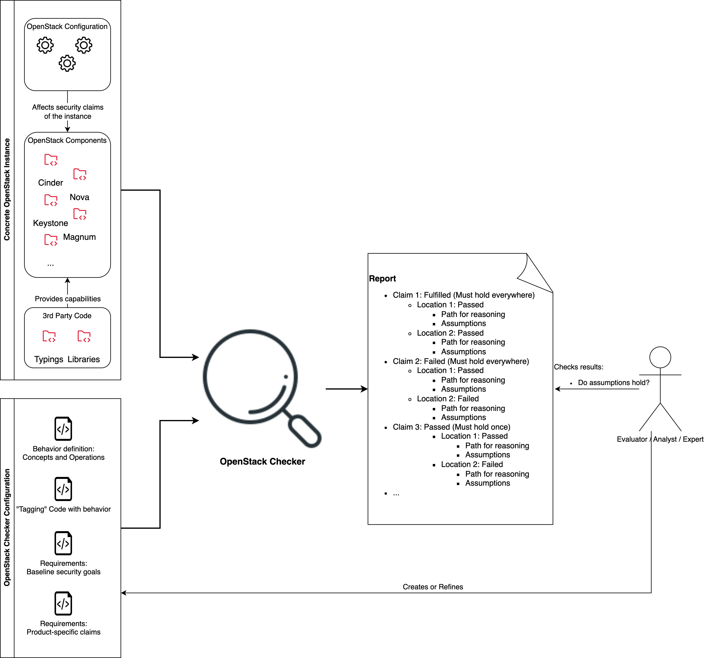

# Goal of the OpenStack Checker

The OpenStack Checker provides tooling and guidelines to assess the security of an instance of OpenStack.
It considers two major aspects:

* The compliance of the OpenStack code base and a specific configuration with respect to security goals, and
* The ecosystem of OpenStack and its development workflow.

## Compliance with Security Goals

Core of this project is a tool which supports an analyst with a semi-automated compliance checks of a specific OpenStack instance.

It receives as an input:

* A set of rules which define the security goals/claims to be evaluated,
* A set of relevant behavioral properties (in the form of so-called concepts and operations) and logic on how to "tag" the code base with them, and
* The OpenStack code base, python interface (.pyi) files of libraries, and a specific configuration of the OpenStack instance.

The tool then performs a static analysis of the code base and configuration and generates a report which indicates whether the security goals are met or not.

The following figure provides a high-level overview of the workflow:

A detailed description of the methodology, and the core components of the OpenStack Checker and its configuration is provided in the section [Methodology](methodology.md).

The [User Guide](user-guide.md) provides a detailed description of the tool and its usage and should enable the human actor to write the respective OpenStack Checker configuration.

## Ecosystem of OpenStack

The analysis of the ecosystem considers security-critical aspects which are not directly visible in the code base of the OpenStack components or their configuration by a cloud provider.
This is complementary to the analysis of the code base and configuration and considering it may serve to ease early detection of problems in the development workflow which can later have an impact on the security of the product.
These include various aspects which are related to the development workflow of OpenStack, such as the use of third-party libraries, the use of CI/CD pipelines and automated checks performed therein, and which parties are involved in the development of OpenStack.

The complete documentation on the analysis of OpenStack's ecosystem is provided in the [Ecosystem Analysis](ecosystem-analysis.md) section.
