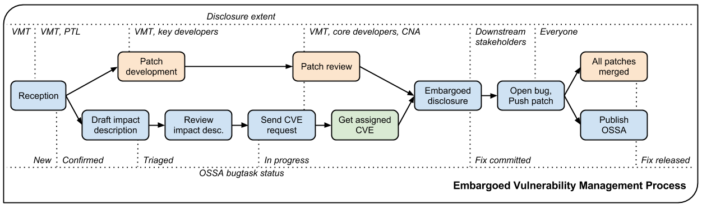

# OpenStack Ecosystem Security Analysis

The purpose of this analysis is to provide a guideline to assessing the security of OpenStack's ecosystem. It underscores that choosing a cloud platform is a fundamental decision that influences many subsequent choices and which is dependent on many variables. Therefore, we also analyze the OpenStack ecosystem regarding the context it provides for good overall security, e.g., to address potential vulnerabilities.

The analysis methodology for the OpenStack security ecosystem focuses on examining the broader context surrounding the OpenStack system. It seeks to clarify essential questions such as which members have the authority to make decisions, the long-term goals of the project, and the rules or voting processes regarding changes, including merge requests or more significant conceptual modifications. Additionally, the quality of the publicly accessible toolchain is scrutinized, addressing how dependencies are managed to prevent supply chain attacks, how high code quality is ensured through build pipelines, and how authorship of contributions to the codebase is verified. The analysis also aims to identify further potential questions within this domain and provide answers to them.

This document is divided into two major parts: First, a general description of multiple OpenStack ecosystem elements, like the vulnerability management process and the contribution processes. Second, a hands-on guideline for evaluating several concrete security criteria, including appropriate tooling that can be used to (semi-)automatically conduct the checks.

## Security-Relevant Elements in the OpenStack Ecosystem 

- TODO add some documentation sources

### Contribution Process
The OpenStack contribution process is a transparent framework that aims as balancing open community involvement and maintaining code quality and security. Contributions are submitted through a review system where changes are assessed by core reviewers. This process includes automated testing and manual code reviews to ensure that any introduced code meets security standards. 

The starting point for OpenStack contributors is its [Contributor Guide](https://docs.openstack.org/contributors/code-and-documentation/index.html).

- TODO: Describe briefly the most important contents of the contributor guide
- TODO: Step-by-step description of how to get a contribution accepted

### CI/CD Architecture
The CI/CD architecture employs automated testing pipelines that run unit tests, integration tests, and security checks on every code change before it is merged. This systematic approach helps identify vulnerabilities early in the development cycle, reducing the risk of security issues in production. Tools like Zuul facilitate this automation, ensuring that only code that passes all tests is deployed.

- TODO: Describe the zuul architecture/hierarchy, e.g. which configs are included in the individual projects, and which configs are maintained in the central repository for zuul configs 


- Openstack development infrastructure: 


- High level processes for code changes: (also available via `contributing.rst` in component repository)
    * Gerrit based workflow:
        1. Submit change for review
        2. review process:
            * code-review: +1 one vote from normal reviewers
            * code-review: +2 vote from core reviewers (at least one, normally two needed for approval)
            * verified: +1 automated testing (ZUUL)
            * workflow: +1 (only core-reviewers) -> indicates approval for gate pipeline
        3. ZUUL merges changes automatically if prerequisites are met

- Openstack Zuul config hierarchy:
  - zuul/zuul-jobs: opendev-global definitions / templates for zuul jobs and roles
  - openstack-zuul-roles: ansible roles
  - openstack-zuul-jobs: openstack-global definitions / templates for zuul-jobs
  - project-config: central repository for all infra related configs (two folders: `zuul.d`, `zuul`)
      - `zuul`: `main.yaml` defines tenants, integrates all projects
      - `zuul.d`: pipeline definition, secrets, job-templates, openstack global jobs, ...
  - project(e.g. nova): project-specific settings in `.zuul.yaml`
      - job-definitions
      - which jobs are performed in which pipeline


### Vulnerability Management

The OpenStack Vulnerability Management Process is designed to transparently handle vulnerabilities. 

The Vulnerability Management Team (VMT) consists of a small group of independent, security-focused individuals who coordinate the handling of vulnerabilities. To maintain fairness and confidentiality, members do not provide prior notice to their employers if they are downstream stakeholders. The team is responsible for overseeing vulnerabilities in both actively maintained stable branches and the master branch.

Vulnerabilities can be reported privately via encrypted email to VMT members or through tools like StoryBoard or Launchpad by marking the issue as a security bug. Upon receiving a report, the VMT takes several actions: they create or verify the existence of a bug entry, confirm the correct project, and adjust details if necessary. They also subscribe the core security review team for impact confirmation and identification of the affected branch.

For private reports, patches are developed privately and pre-approved by core reviewers to facilitate a fast-tracked public code review upon disclosure. In the case of public reports, the standard public code review process of OpenStack applies. 
 


- TODO: Describe step-by-step how to report a security issue

## Guideline for Security Assessment
In the following, multiple ecosystem-related security criteria are described and analyzed for various OpenStack components. Some of the checks are based on the [Open Source Security Foundation checks](https://scorecard.dev/#the-checks) for open-source repositories. This OSSF scorecard, however, cannot be applied to OpenStack components without limitations. Below, a table shows which of the automated OSSF checks can be used for the OpenStack GitHub mirrors.

| OSSF Check | Compatibility with Openstack |
|------------|------------------------------|
| Vulnerabilities | Yes (uses OSV Scanner) |
| Dependency Update Tool | ? (checks for configuration files of certain tools, should be functional) |
| Maintained | Yes (partially: only check for commit-dates) |
| Security Policy | Yes (checks for `SECURITY.md` file and analyzes it)|
| Licence | Yes (partially: only file location based checks)|
| CII Best Practices | No (Checks OSSF Best Practices Batch) |
| CI Tests | No |
| Fuzzing | ? (propably not) |
| SAST (Static Application Security Testing) | No |
| Binary Artifacts | yes (checks source tree) |
| Branch Protection | No |
| Dangerous Workflow | No |
| Code Review | No |
| Contributors | Yes (if commit authors are known by Github) |
| Pinned Dependencies | Yes (at least for `requirements.txt`) |
| Token Permissions | No |
| Packaging | No |
| Signed Releases | No |

### G1: Checking Known Vulnerabilities
Open vulnerabilities can be easily exploited by attackers and need to be addressed promptly. This check assesses if the project contains open, unresolved vulnerabilities in its codebase or dependencies. 

For the purpose of assessing open vulnerabilities for OpenStack components, the OSV (Open Source Vulnerabilities) service can be used. A further possibility is to generate SBOMs and analyze them, using existing tooling.

The OSV (Open Source Vulnerabilities) service allows to review vulnerabilities in open-source projects. A [search for openstack vulnerabilities](https://osv.dev/list?q=OpenStack&ecosystem=) results in various potential vulnerabilities in different OpenStack-related packages.
For severe security issues, OpenStack security advisories (OSSAs) are published. In 2024, five such OSSAs have been published.

Guideline
- TODO provide more detailed guide on how to use OSV etc.
- Check KPIs:
  - Contributors in the Current Release​: Total number of contributors involved in the current release​ (e.g. >2)
  - Contributor Diversity​: Diversity of contributors based on affiliation ​(e.g. >2)
  - “Do not merge” votings in the current release​: Number of votings with the worst assessment of a contribution, i.e. “Do not merge”​ (e.g. <5)
  - Filed-to-resolved-bugs ratio​: How many bugs were filed vs how many were resolved​ (e.g. >33%​)
  - Abandoned change requests in the current release​: Number of change requests that were contributed but abandoned​ (e.g. <10​)
  - Number of Reviewers​: Total number of reviewers involved in the current release​ (e.g. >10​)
  - Review Diversity​: Diversity of reviewers based on affiliation ​(e.g. >=2 companies​)
  - Contribution Frequency​: Regularity and frequency of contributions by each contributor (e.g. top 10 contributors have been active for >12 months​)
  - Code Review Participation​: Percentage of contributions that undergo peer review (e.g. 100%).
- Set desired security target values and use tooling to assess the values


### G2: Checking Continuous Maintenance

#### Dependency Update Tool
Using a dependency update tool ensures that updates are done timely for all dependencies in a project. Popular examples for dependency update tools include Dependabot and Renovate bot.

[A central list of all the requirements](https://docs.openstack.org/project-team-guide/dependency-management.html) that are allowed in OpenStack projects is globally maintained. The OpenStack [proposal bot](https://review.opendev.org/q/owner:proposal-bot) then automatically proposes updates to OpenStack dependencies. These proposals follow a defined workflow with reviews that verify that the proposed updates can be integrated. 

Guideline: 
- Check https://review.opendev.org/q/owner:proposal-bot to see if the OpenStack proposal bot is active / has been active in the past

#### Activity
An inactive project may not receive patches, have its dependencies updated, or be actively tested and used. Some software, particularly smaller utility functions, typically doesn't require ongoing maintenance. However, OpenStack components can be expected to be actively maintained.

This check assesses whether the project is actively maintained. In the OSSF check, an archived project receives the lowest score, while a project with at least one commit per week over the last 90 days earns the highest score. If there is activity on issues from collaborators, members, or owners, the project receives a partial score.

There is a [list of designations for OpenStack projects](https://wiki.openstack.org/wiki/ProjectTypes) as follows:
- Core: official projects with full access to OpenStack brand and assets
- Incubated: projects that have been approved for the Incubator program which puts them on an official track to become core projects
- Library: library projects are directly or indirectly used by the core projects
- Gating: gating projects are used in the continuous integration processes, for example as integration test suites and specific deployment tools
- Supporting: supporting projects are used for, e.g., documentation and development infrastructure
- Related: related projects are unofficial projects are somehow associated with OpenStack but are not officially tied to OpenStack

The projects that can be considered to strictly follow the OpenStack security guidelines are thus the Core projects. Still, other projects are also actively maintained. The OSSF Maintained check defines a threshold of a maximum of 90 days for the last maintenance activity. A look at the list of OpenStack components on opendev.org, sorting them by _oldest_, [shows that all OpenStack components have been updated within the last day](https://opendev.org/openstack?q=&sort=oldest).

Guideline:
- Identify relevant OpenStack components
- Check their project type, verify that it is a Core project
- Check the dates of their last commits; verify they have been actively maintained 

#### Security-Policy
OpenStack maintains a general security policy for the projects. A security policy gives users information about what constitutes a vulnerability and how to report one securely so that information about a bug is not publicly visible.

This check examines the contents of the security policy checking for vulnerability process(es), disclosure timelines, and links (e.g., URL(s) and email(s)) to support users.

The requirements for the Security-Policy check (based on OSSF criteria) are as follows:

Linking Requirements (one or more):
- A valid form of an email address to contact for vulnerabilities
- A valid form of a http/https address to support vulnerability reporting

Free Form Text:
- Free form text is present in the security policy file which is beyond simply having a http/https address and/or email in the file
- The string length of any such links in the policy file do not count towards detecting free form text

Security Policy Specific Text:
- Specific text providing basic or general information about vulnerability and disclosure practices, expectations, and/or timelines
- Text should include a total of 2 or more hits which match (case-insensitive) vuln and as in "Vulnerability" or "vulnerabilities"; disclos as "Disclosure" or "disclose"; and numbers which convey expectations of times, e.g., 30 days or 90 days

OpenStack has a vulnerability management team [with four members](https://security.openstack.org/vmt.html) and a documented [Vulnerability Management Process](https://security.openstack.org/vmt-process.html). Email addresses to contact in relation to vulnerabilities are published on the respective web pages.
The Free Form Text criterion as well as the Security Policy Specific Text criterion are thus also fulfilled by the OpenStack [Vulnerability Management Process](https://security.openstack.org/vmt-process.html) (VMP). The VMP also defines time periods, for example for the disclosure to downstream stakeholders. However, to the best of the authors' knowledge, no time frame is defined for the patch development and review.

OpenStack (Core) projects therefore fulfill the Security-Policy check at the time of writing.

#### License
A license provides users with details on how the source code can or cannot be used. The absence of a license hinders any security review or audit and poses a legal risk for potential users.
This check therefore aims to identify if the project has a published license. It operates by utilizing hosting APIs or by examining standard locations for a file named according to common licensing conventions. 

According to OSSF, the license should be declared as follows:
- There should be a LICENSE, COPYRIGHT, or COPYING filename, or license files in a LICENSES directory
- The license file should be at the top-level directory
- A FSF or OSI license should be specified

In OpenStack projects, these files are contained in the opendev repositories.

OpenStack components are published under the Apache 2.0 license which can be found in the LICENSE file in each repository, see, for example, https://opendev.org/openstack/nova/src/branch/master/LICENSE.
The criteria listed above are all fulfilled for OpenStack components.


### G3: Checking CII Best Practices
The OpenSSF Best Practices Badge Program specifies best practices for open-source projects and assesses whether they follow the best practices. It is therefore a valuable starting point for checking the security and reliability of an open-source project (since it also comprises security requirments). The program awards passing, silver, or gold level badges. The automatic OSSF evaluation utilizes the Git repository URL along with the OpenSSF Best Practices badge API. 

OpenStack [has the _passing_ badge](https://www.bestpractices.dev/de/projects?q=openstack), which is the lowest of three levels. Some of the criteria that are not fulfilled for the silver and gold badges, [include the following](https://www.bestpractices.dev/de/projects/246?criteria_level=2):
- The project website, the repository, and the downloaded pages (if separate) MUST include key-hardening headers with non-permeable values
- The project MUST apply at least one dynamic analysis tool to each upcoming major production release of the software produced by the project before its release.

Note that some criteria are not clearly documented, e.g. _The project SHOULD support multiple cryptographic algorithms so that users can quickly switch if one is compromised. Common symmetric key algorithms include AES, Twofish, and Serpent. Common cryptographic hash algorithm alternatives include SHA-2 (including SHA-224, SHA-256, SHA-384, and SHA-512) and SHA-3._ 
- TODO: pick up the most relevant ones and analyze them manually

### G4: Checking Continuous Testing
#### CI Tests
Executing tests allows developers to identify errors at an early stage, which can reduce the number of vulnerabilities that enter a project. This check therefore aims to verify whether tests are executed prior to merging pull requests. 

OpenStack projects use [Zuul](https://zuul-ci.org/). Also, the OpenStack documentation gives insight into the [testing procedures](https://docs.openstack.org/project-team-guide/testing.html).
Zuul results can be reviewed on [opensearch](https://opensearch.logs.openstack.org/_dashboards/app/discover?security_tenant=global) with the credentials openstack/openstack. One can filter results, e.g., for failed builds or visualize charts about the ratio of success and failures.

Note also that a consistent [testing interface](https://governance.openstack.org/tc/reference/project-testing-interface.html) has been defined across OpenStack projects and common requirements for testing are defined.

#### Fuzzing
Fuzzing involves inputting unexpected or random data into a program to uncover bugs. Conducting regular fuzzing is crucial for identifying vulnerabilities that could be exploited, particularly since attackers may utilize fuzzing to discover the same issues.

Formerly, there was an OpenStack fuzzing tool called [Syntribos](https://github.com/openstack-archive/syntribos), which is now archived. CI files (such as the [Nova CI file](https://opendev.org/openstack/nova/src/branch/master/.zuul.yaml)) do not indicate a standard usage of fuzzing tools in the pipeline. Also, the [security guide](https://docs.openstack.org/security-guide/) does not mention fuzzing tools. 
In OpenStack components, the Tox automation tool is used to run different types of tests. The ```tox.ini``` files in the components' repositories, however, do not contain references to fuzzing tools. At the time of writing, it is thus assumed that security reviewers can, but are not forced to, use fuzzing tools in their reviews.

#### SAST
SAST is testing performed on source code prior to executing the application. Utilizing SAST tools can help prevent known types of bugs from being unintentionally introduced into the codebase.

The [OpenStack documentation](https://docs.openstack.org/security-guide/compliance/compliance-activities.html) mentions code analysis, penetration testing, and other approaches for security reviews, but does not clearly stipulates their usage. [Bandit](https://wiki.openstack.org/wiki/Security/Projects/Bandit) is a Python SAST tool that was originally developed in OpenStack, but is now independent. The ```tox.ini``` files in the components' repositories show which SAST and other tooling is applied. Nova's tox file, for example [includes the usage of Bandit](https://github.com/openstack/nova/blob/master/tox.ini#L275). Also Cinder and Barbican include Bandit testing.
It is unclear, however, if it is mandatory to include SAST tools in the testing of OpenStack components.

### G5: Checking CI/CD Security
TODO: KPIs
#### Branch Protection
Branches, especially the main project branches (e.g. `main or master`, `release`), should be protected such that a defined workflow pattern for applying changes is enforced. This is necessary to prevent malicious code changes.
Potential checks (OSSF groups these in different tiers) include:
* prevent force push
* prevent branch deletion
* require PRs for code changes
* amount of necessary reviewer approvals before merging code
* code owner review necessary
* require branch to be up to date before pushing
* require approval of the most recent reviewable push
* require automated checks for approval

Open issues: Verification that official workflow can not be easily bypassed (e.g. missing api restrictions).

Opendev Gerrit-Workflow ensures the following aspects:
* Code must be approved by at least one core-reviewer
* Code must pass automated gate tests
* code must pass automated testcases
* if all conditions are met code gets automatically merged

This corresponds to tier 4 according to ossf defintions.

- TODO: idiomatic way to check repository settings for given openstack project


#### Dangerous Workflows
Test for dangerous patterns in CI/CD scripts. Vulnerabilities in such scripts may lead to repository compromise,
leakage of secrets and remote code execution.

Examples:
* untrusted code checkouts
* script injection via untrusted context variables

Openstack uses the opendev infrastucture for code hosting and building. Thereby openstack components heavily rely on Zuul as
CI/CD framework (s. [opendev workflow](https://docs.opendev.org/opendev/infra-manual/latest/gettingstarted.html#the-opendev-workflow)). OSSF scorecard currently has not build in support for Zuul-related configuration files. Therefore further analysis of Zuul configuration files and pipeline syntax is necessary.


#### Token Permissions
Check if tokens used in workflow-pipelines follows the principle of least privilege. For example, a pipeline 
performing only automated tests on the repository code just requires read-only access to the repository content. 
Therefore, even if an attacker is able to compromise the pipeline-code, he is still not able to alter the 
repository content.

OSSF scorecard currently is not capable of analysing Zuul related configuration files. Further investigation of the Zuul framework and its integration in opendev is necessary for understanding necessary access privileges. This is necessary in order to allow assessing whether pipeline scripts of a openstack component follow the principle of least privilege.


### G5: Checking Code Contributions and Reviews
#### Code Review
Check whether code changes are reviewed by **humans** before they are added to the repository. Code reviews
are crucial to ensure the quality of code and to prevent potential vulnerabilities or malicious code injections 
in the first place.

Code changes need to be reported using Gerrit. Once visible, everyone is allowed to review the changes and provide feedback 
via a voting system. Only core-reviewers are allowed to give a `+2` vote which is mandatory for approving changes. Per
Openstack convention, at least two independent core-reviewers must provide such a vote in order to approve code changes for merging. Furthermore, before being merged code changes need to pass several test-pipelines. Merging is performed automatically using Zuul.


#### Contributors
Check whether project has contributors from different organizations. Knowledge about contributing organizations
may help in deciding whether a project is trustworthy or not.

Applying OSSF scorecards on the Github mirror of openstack-nova revealed a total of 47 different contributing organizations.
Amongst them RedHat, Nvidia and IBM.

Check KPIs:
- Contributors in the Current Release: Total number of contributors involved in the current release (e.g. >2)
- Contributor Diversity: Diversity of contributors based on affiliation (e.g. >=2 companies)
- “Do not merge” votings in the current release: Number of votings with the worst assessment of a contribution, i.e. “Do not merge” (e.g. <5)
- Filed-to-resolved-bugs ratio: How many bugs were filed vs how many were resolved (e.g. >33%)
- Abandoned change requests in the current release: Number of change requests that were contributed but abandoned (e.g. <10)
- Number of Reviewers: Total number of reviewers involved in the current release (e.g. >10)
- Review Diversity: Diversity of reviewers based on affiliation (e.g. >=2 companies)
- Contribution Frequency: Regularity and frequency of contributions by each contributor (e.g. Top 10 contributors have been active for >12 months)
- Code Review Participation: Percentage of contributions that undergo peer review (e.g. 100%)

- TODO step-by-step guide on how to assess these KPIs (go to stackalytics, select filter XY, ...)

### G6: Checking Build Risks

#### Binary Artifacts
The project repository should be free of executable binary artifacts (e.g. for Python `.pyc` files). Binary artifacts can not be easily reviewed, especially if the corresponding source code is not available.

The repository of Openstack nova contains no binary artifacts. (OSSF tool applied on github mirror of nova).


#### Pinned Dependencies
The project should explicitly pin dependencies used for builds and releases not only by version but also with a
dedicated hash. Thereby it is ensured that always the same software is used enhancing reproducibility. This also 
mitigates the risk that new vulnerabilities are introduced by automatic updates or malicious package 
repositories. 

Applying OSSF scorecards on the Github mirror of openstack nova, no pinned dependencies have been found.
A `requirements.txt` exits ([link](https://github.com/openstack/nova/blob/master/requirements.txt)), but only a minimum 
version number is defined for each dependency. Furthermore, it is stateted in a comment that these lower bounds are only 
kept up to date on a best effort basis. For passing the check, explicit hashes of the used versions would be necessary (see [PIP doc on secure installs](https://pip.pypa.io/en/stable/topics/secure-installs/#secure-installs)).


#### Packaging
Check whether the project publishes packages. Packages make it easier for customers to install and use the latest 
version as well as receiving security critical patches.

Opendev supports automatic publishing of releases on [PyPI](https://docs.opendev.org/opendev/infra-manual/latest/creators.html#give-opendev-permission-to-publish-releases).

#### Signed Releases
Official project artifacts like packages should be accompanied with a cryptographic signature. This allows a user 
to verify the provenance of artifacts as well as their integrity. This is crucial in order to establish trust 
into such artifacts.

[Releases seem to be signed](https://tarballs.opendev.org/openstack/nova/). Nevertheless, the signature is not visible on 
https://releases.openstack.org/dalmatian/index.html#nova as well as on [PyPI](https://pypi.org/project/nova/).