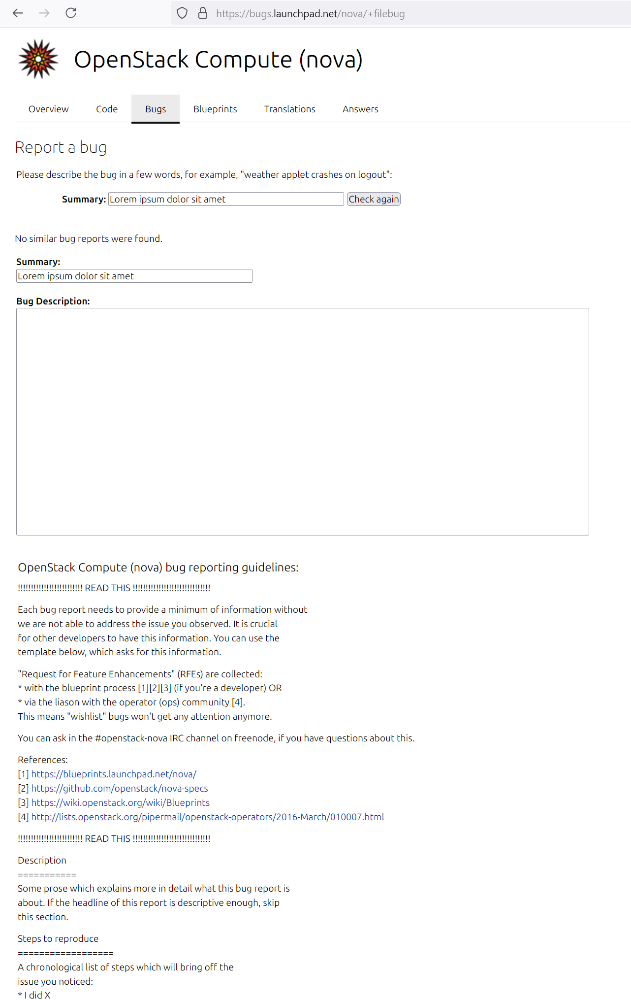
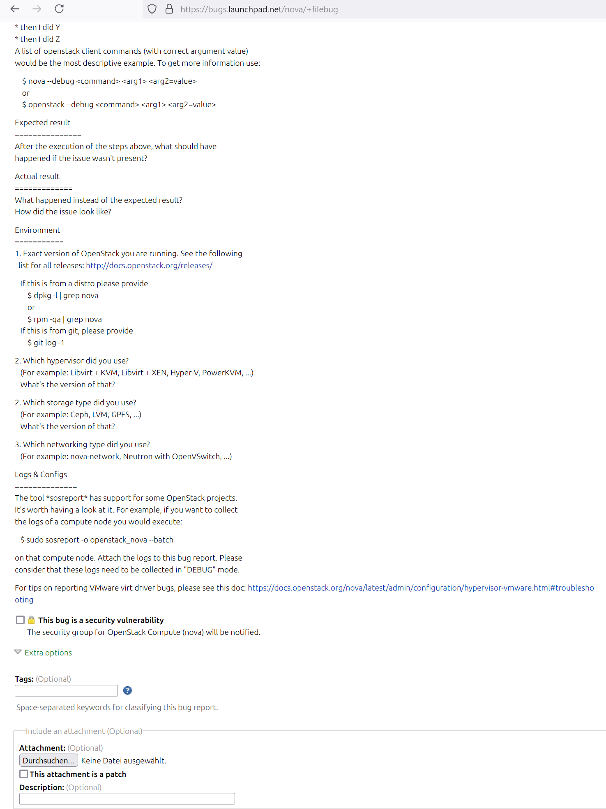
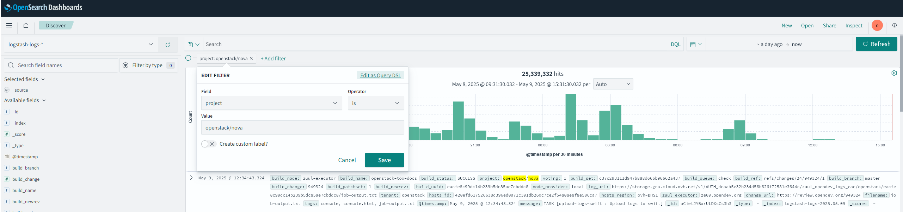
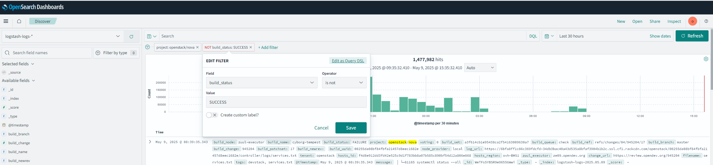
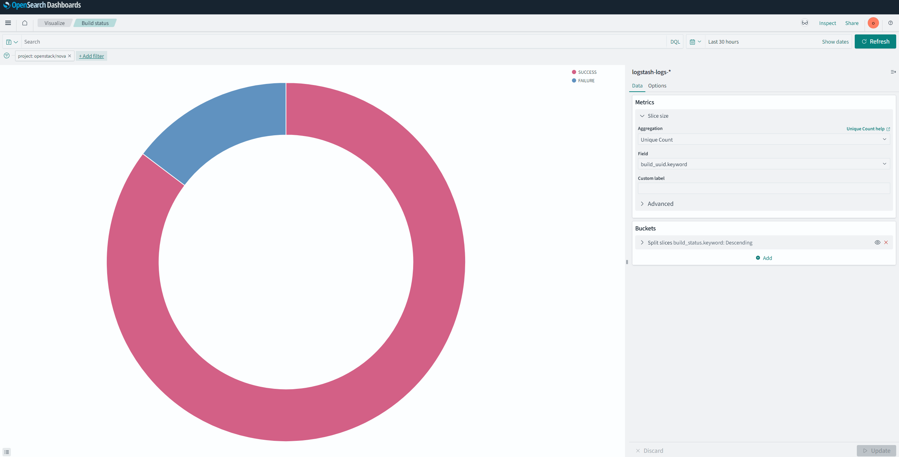
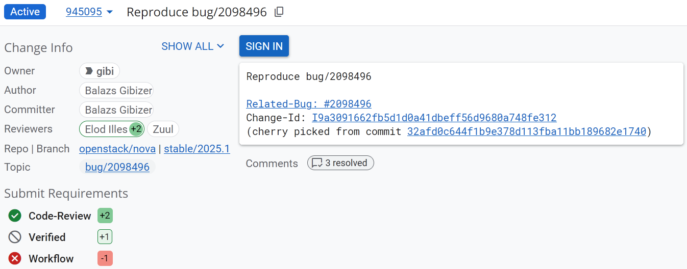
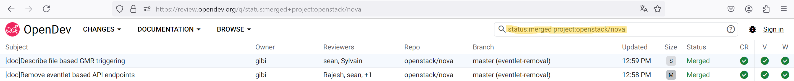

# OpenStack Ecosystem Security Analysis

The purpose of this analysis is to provide a guideline to assessing the security of OpenStack's ecosystem. It underscores that choosing a cloud platform is a fundamental decision that influences many subsequent choices and which is dependent on many variables. Therefore, we also analyze the OpenStack ecosystem regarding the context it provides for good overall security, e.g., to address potential vulnerabilities.

The analysis methodology for the OpenStack security ecosystem focuses on examining the broader context surrounding the OpenStack system. It seeks to clarify essential questions such as which members have the authority to make decisions, the long-term goals of the project, and the rules or voting processes regarding changes, including merge requests or more significant conceptual modifications. Additionally, the quality of the publicly accessible toolchain is scrutinized, addressing how dependencies are managed to prevent supply chain attacks, how high code quality is ensured through build pipelines, and how authorship of contributions to the codebase is verified. The analysis also aims to identify further potential questions within this domain and provide answers to them.

This document is divided into two major parts: First, a general description of multiple OpenStack ecosystem elements, like the vulnerability management process and the contribution processes. Second, a hands-on guideline for evaluating several concrete security criteria, including appropriate tooling that can be used to (semi-)automatically conduct the checks.

## Security-Relevant Elements in the OpenStack Ecosystem 

### Contribution Process
The OpenStack contribution process is a transparent framework that aims as balancing open community involvement and maintaining code quality and security. Contributions are submitted through a review system where changes are assessed by core reviewers. This process includes automated testing and manual code reviews to ensure that any introduced code meets security standards. 

The starting point for OpenStack contributors is its [Contributor Guide](https://docs.openstack.org/contributors/code-and-documentation/index.html).

To most important aspects of being able to contribute to an openstack project are explained in the [Quick Start Guide](https://docs.openstack.org/contributors/code-and-documentation/quick-start.html#set-up-accounts-and-configure-environment). Further information for working on openstack code can be found in the [Opendev Development Workflow](https://docs.opendev.org/opendev/infra-manual/latest/developers.html#development-workflow). The specific contribution workflows may differ between openstack projects and are usually described in the project documentations (e.g. [nova contribution guide](https://docs.openstack.org/nova/latest/contributor/contributing.html)).

Major steps for getting a contribution accepted:

1. Commit changes according to [guideline](https://docs.opendev.org/opendev/infra-manual/latest/developers.html#committing-changes)
2. Submit change for review with `git review`
3. Pass initial [automated testing](https://docs.opendev.org/opendev/infra-manual/latest/developers.html#automated-testing): get a `Verified +1` by passing the check-pipeline
4. Update change according to test-results and [peer-review process](https://docs.opendev.org/opendev/infra-manual/latest/developers.html#peer-review)
5. If there are positive `+1` reviews, try to get attention of core-developers via [IRC](https://docs.opendev.org/opendev/infra-manual/latest/developers.html#peer-review)
6. Get `+2` reviews from two different core-developers and a `Workflow +1` from one core developer in order to trigger the `gate-pipeline`
7. If the change passes the [gate](https://docs.opendev.org/opendev/infra-manual/latest/developers.html#peer-review), it is merged automatically

### CI/CD Architecture
The CI/CD architecture employs automated testing pipelines that run unit tests, integration tests, and security checks on every code change before it is merged. This systematic approach helps identify vulnerabilities early in the development cycle, reducing the risk of security issues in production. Tools like Zuul facilitate this automation, ensuring that only code that passes all tests is deployed.

- Openstack development infrastructure: 


- High level processes for code changes: (also available via `contributing.rst` in component repository)
    * Gerrit based workflow:
        1. Submit change for review
        2. review process:
            * code-review: +1 one vote from normal reviewers
            * code-review: +2 vote from core reviewers (at least one, normally two needed for approval)
            * verified: +1 automated testing (ZUUL)
            * workflow: +1 (only core-reviewers) -> indicates approval for gate pipeline
        3. ZUUL merges changes automatically if prerequisites are met

- Openstack Zuul config hierarchy:
  - zuul/zuul-jobs: opendev-global definitions / templates for zuul jobs and roles
  - openstack-zuul-roles: ansible roles
  - openstack-zuul-jobs: openstack-global definitions / templates for zuul-jobs
  - project-config: central repository for all infra related configs (two folders: `zuul.d`, `zuul`)
      - `zuul`: `main.yaml` defines tenants, integrates all projects
      - `zuul.d`: pipeline definition, secrets, job-templates, openstack global jobs, ...
  - project(e.g. nova): project-specific settings in `.zuul.yaml`
      - job-definitions
      - which jobs are performed in which pipeline


### Vulnerability Management

The OpenStack Vulnerability Management Process is designed to transparently handle vulnerabilities. 

The Vulnerability Management Team (VMT) consists of a small group of independent, security-focused individuals who coordinate the handling of vulnerabilities. To maintain fairness and confidentiality, members do not provide prior notice to their employers if they are downstream stakeholders. The team is responsible for overseeing vulnerabilities in both actively maintained stable branches and the master branch.

Vulnerabilities can be reported privately via encrypted email to VMT members or through tools like StoryBoard or Launchpad by marking the issue as a security bug. Upon receiving a report, the VMT takes several actions: they create or verify the existence of a bug entry, confirm the correct project, and adjust details if necessary. They also subscribe the core security review team for impact confirmation and identification of the affected branch.

For private reports, patches are developed privately and pre-approved by core reviewers to facilitate a fast-tracked public code review upon disclosure. In the case of public reports, the standard public code review process of OpenStack applies. 
 


How to report a security issue:  
See the [official recommendations](https://security.openstack.org/reporting.html).

Major aspects:
- assure private reporting by either sending an encrypted email or checking the respective `private` and `security related` checkboxes for a [bug report](https://security.openstack.org/reporting.html)
- reports are embargoed for a maximum of 90 days before being made public, regardless the resolution state

Example bug report for `nova`



## Guideline for Security Assessment
In the following, multiple ecosystem-related security criteria are described and analyzed for various OpenStack components. Some of the checks are based on the [Open Source Security Foundation checks](https://scorecard.dev/#the-checks) for open-source repositories. This OSSF scorecard, however, cannot be applied to OpenStack components without limitations. Below, a table shows which of the automated OSSF checks can be used for the OpenStack GitHub mirrors.

| OSSF Check | Compatibility with Openstack |
|------------|------------------------------|
| Vulnerabilities | Yes (uses OSV Scanner) |
| Dependency Update Tool | ? (checks for configuration files of certain tools, should be functional) |
| Maintained | Yes (partially: only check for commit-dates) |
| Security Policy | Yes (checks for `SECURITY.md` file and analyzes it)|
| Licence | Yes (partially: only file location based checks)|
| CII Best Practices | No (Checks OSSF Best Practices Batch) |
| CI Tests | No |
| Fuzzing | ? (propably not) |
| SAST (Static Application Security Testing) | No |
| Binary Artifacts | yes (checks source tree) |
| Branch Protection | No |
| Dangerous Workflow | No |
| Code Review | No |
| Contributors | Yes (if commit authors are known by Github) |
| Pinned Dependencies | Yes (at least for `requirements.txt`) |
| Token Permissions | No |
| Packaging | No |
| Signed Releases | No |

### Overview Guidlines
- [G1: Checking Known Vulnerabilities](#g1-checking-known-vulnerabilities)
- [G2: Checking Continuous Maintenance](#g2-checking-continuous-maintenance)
- [G3: Checking CII Best Practices](#g3-checking-cii-best-practices)
- [G4: Checking Continuous Testing](#g4-checking-continuous-testing) 
- [G5: Checking CI/CD Security](#g5-checking-cicd-security)
- [G6: Checking Code Contributions and Reviews](#g6-checking-code-contributions-and-reviews)
- [G7: Checking Build Risks](#g7-checking-build-risks)

### G1: Checking Known Vulnerabilities
Open vulnerabilities can be easily exploited by attackers and need to be addressed promptly. This check assesses if the project contains open, unresolved vulnerabilities in its codebase or dependencies. 

For the purpose of assessing open vulnerabilities for OpenStack components, the OSV (Open Source Vulnerabilities) service can be used. A further possibility is to generate SBOMs and analyze them using existing tooling. One existing tool is OWASP [Dependency Track](https://dependencytrack.org/). In this guideline, we focus on the OSV (Open Source Vulnerabilities) service which allows to review vulnerabilities in open-source projects. 


#### HowTo:
- Create a list of components to be used, e.g. Nova, Barbican, etc.
- Use [osv.dev](http://osv.dev) to search for vulnerabilities in the specified components. The github repository link can be used to search for the concrete project, e.g. github.com/openstack/nova
- Assess the severity of the vulnerabilities, check if fixes are available, and ensure that they are integrated

Result: A [search for openstack vulnerabilities in the github.com/openstack/nova package](https://osv.dev/list?q=github.com%2Fopenstack%2Fnova&ecosystem=) results in various potential vulnerabilities. One listed vulnerability, for example, is [CVE-2022-47951](https://osv.dev/vulnerability/CVE-2022-47951) which shows that the vulnerability has been fixed.
For severe security issues, [OpenStack security advisories](https://security.openstack.org/ossalist.html) (OSSAs) are published. In 2024, five such OSSAs have been published. It should thus also be checked if current OSSAs exist for the components that are planned to be used.


### G2: Checking Continuous Maintenance

#### Dependency Update Tool
Using a dependency update tool ensures that updates are done timely for all dependencies in a project. Popular examples for dependency update tools include Dependabot and Renovate bot.

[A central list of all the requirements](https://docs.openstack.org/project-team-guide/dependency-management.html) that are allowed in OpenStack projects is globally maintained. The OpenStack [proposal bot](https://review.opendev.org/q/owner:proposal-bot) then automatically proposes updates to OpenStack dependencies. These proposals follow a defined workflow with reviews that verify that the proposed updates can be integrated. 

#### HowTo:
- Verify that the proposal bot is active on OpenDev, filtering for contributions by the bot using https://review.opendev.org/q/owner:proposal-bot

At the time of writing, the OpenStack proposal bot is in active use.

#### Activity
An inactive project may not receive patches, have its dependencies updated, or be actively tested and used. Some software, particularly smaller utility functions, typically doesn't require ongoing maintenance. However, OpenStack components can be expected to be actively maintained.

This check assesses whether the project is actively maintained. In the respective OSSF check, an archived project receives the lowest score, while a project with at least one commit per week over the last 90 days earns the highest score. If there is activity on issues from collaborators, members, or owners, the project receives a partial score.

In the OpenStack ecosystem, projects are generally very active. Still, the projects that are planned to be used can be checked for their active maintenance. The OSSF Maintained check defines a threshold of a maximum of 90 days for the last maintenance activity. 

#### HowTo:
To perform this check, retrieve a list of OpenStack components on [opendev.org, sorting them by _oldest_](https://opendev.org/openstack?q=&sort=oldest).

At the time of writing, all OpenStack components have been updated recently.

#### Security-Policy
OpenStack maintains a general security policy for the projects. A security policy gives users information about what constitutes a vulnerability and how to report one securely so that information about a bug is not publicly visible. This check therefore examines the security policy checking for vulnerability process(es), disclosure timelines, and links (e.g., URL(s) and email(s)) to support users. 

#### HowTo:
The requirements for the Security-Policy check (based on OSSF criteria) are as follows:

Linking Requirements (one or more):
- A valid form of an email address to contact for vulnerabilities
- A valid form of a http/https address to support vulnerability reporting

Free Form Text:
- Free form text is present in the security policy file which is beyond simply having a http/https address and/or email in the file
- The string length of any such links in the policy file do not count towards detecting free form text

Security Policy Specific Text:
- Specific text providing basic or general information about vulnerability and disclosure practices, expectations, and/or timelines
- Text should include a total of 2 or more hits which match (case-insensitive) vuln as in "Vulnerability" or "vulnerabilities"; disclos as in "Disclosure" or "disclose"; and numbers which convey expectations of times, e.g., 30 days or 90 days

OpenStack has a vulnerability management team [with four members](https://security.openstack.org/vmt.html) and a documented [Vulnerability Management Process](https://security.openstack.org/vmt-process.html). Email addresses to contact in relation to vulnerabilities are published on the respective web pages.
The Free Form Text criterion as well as the Security Policy Specific Text criterion are thus also fulfilled by the OpenStack [Vulnerability Management Process](https://security.openstack.org/vmt-process.html) (VMP). The VMP also defines time periods, for example for the disclosure to downstream stakeholders. However, to the best of the authors' knowledge, no time frame is defined for the patch development and review.

OpenStack (Core) projects therefore fulfill the Security-Policy check at the time of writing.

#### License
A license provides users with details on how the source code can or cannot be used. The absence of a license hinders any security review or audit and poses a legal risk for potential users.
This check therefore aims to identify if the project has a published license. It operates by utilizing hosting APIs or by examining standard locations for a file named according to common licensing conventions. 

#### HowTo:
According to OSSF, the license should be declared as follows:
- There should be a LICENSE, COPYRIGHT, or COPYING filename, or license files in a LICENSES directory
- The license file should be at the top-level directory
- A FSF or OSI license should be specified

OpenStack components are published under the Apache 2.0 license which can be found in the LICENSE file in each repository, see, for example, https://opendev.org/openstack/nova/src/branch/master/LICENSE.

The criteria listed above are all fulfilled for OpenStack components.

### G3: Checking CII Best Practices
The OpenSSF Best Practices Badge Program specifies best practices for open-source projects and assesses whether they follow the best practices. It is therefore a valuable starting point for checking the security and reliability of an open-source project (since it also comprises security requirements). The program awards passing, silver, or gold level badges. The automatic OSSF evaluation utilizes the Git repository URL along with the OpenSSF Best Practices badge API. 

OpenStack [has the _passing_ badge](https://www.bestpractices.dev/de/projects?q=openstack), which is the lowest of three levels. Some of the criteria that are not fulfilled or are not clearly assessed for the silver and gold badges, [include the following](https://www.bestpractices.dev/de/projects/246?criteria_level=2):
- The project website, the repository, and the download site (if separate) MUST include key-hardening headers with non-permeable values
- The project MUST apply at least one dynamic analysis tool to each upcoming major production release of the software produced by the project before its release.

### HowTo:
- Check the [OpenStack project on OpenSSF Best Practices](https://www.bestpractices.dev/de/projects/246)
Thus, the security criteria that are explicitly _not fulfilled_ should be checked to see whether they present a significant security risk. 
- Click on the levels that are not fulfilled (for OpenStack: silver and gold), check the security criteria, and check whether any security criteria are _not fulfilled_
- Assess the criteria's impacts on the project's security

According to the CII assessment, there is one that is not fulfilled for Openstack, i.e. the key hardening headers Content Security Policy (CSP), HTTP Strict Transport Security (HSTS), X-Content-Type-Options, and X-Frame-Options should be set and maintained. These headers are used to prevent, e.g., cross-site scripting, man-in-the-middle, and clickjacking attacks. Since the headers CSP, HSTS, and X-Content-Type-Options are not set for opendev.org (see https://securityheaders.com/?q=opendev.org&followRedirects=on), they can present a security risk in the usage of the code repository.

### G4: Checking Continuous Testing
#### CI Tests
Executing tests allows developers to identify errors at an early stage, which can reduce the number of vulnerabilities that enter a project. This check therefore aims to verify whether tests are executed prior to merging pull requests. 

OpenStack projects use [Zuul](https://zuul-ci.org/). Also, the OpenStack documentation gives insight into the [testing procedures](https://docs.openstack.org/project-team-guide/testing.html).
Zuul results can be reviewed on [opensearch](https://opensearch.logs.openstack.org/_dashboards/app/discover?security_tenant=global) with the credentials openstack/openstack. One can filter results, e.g., for failed builds or visualize charts about the ratio of success and failures.\
For example to get the Zuul results for nova, one needs to filter the field `project` for `openstack/nova`:

In order to only see not successfull builds, one can filter the field `build_status`:

In order to see a visualization of the build-status of a given project (e.g. `nova`), one can choose`build_status` in the tab `visualization` and filter for the desired project:


Note also that a consistent [testing interface](https://governance.openstack.org/tc/reference/project-testing-interface.html) has been defined across OpenStack projects and common requirements for testing are defined.

For official OpenStack projects continuous testing is enforced with Gerrit and Zuul. Change requests must pass a `check` and a 
`gate` pipeline prior merging ([s. developer documentation](https://docs.opendev.org/opendev/infra-manual/latest/developers.html#automated-testing)).

##### HowTo:
In order to assure that a given OpenStack project performs test prior merging code changes, it needs to be verified that it is correctly configured and integrated
in the Openstack CI/CD-Framework. In the following, we use `nova` as example for the necessary checks.

- The project repository should be hosted on [opendev/openstack](https://opendev.org/openstack) (e.g. [nova](https://opendev.org/openstack/nova))
- The repository should be based on the official [cookiecutter-template](https://opendev.org/openstack/cookiecutter)

- The repository must contain a `.zuul.yaml` in the repository root (e.g. [nova](https://opendev.org/openstack/nova/src/branch/master/.zuul.yaml))
- The `.zuul.yaml` should define project specific job-definitions ideally based on templates (s. example taken from nova below)
```yaml
- job:
    name: nova-tox-functional-py39
    parent: openstack-tox-functional-py39 # inherit definitions from parent template
```
- In `.zuul.yaml`: ensure that the `check` and `gate` pipelines are populated with jobs (s. example taken from nova below)
```yaml
- project:
    # Please try to keep the list of job names sorted alphabetically.
    templates:
        - ...
    check:
      jobs:
        - nova-tox-functional-py39
        - ...
    gate:
      jobs:
        - nova-tox-functional-py39
        - ...
```
- The repository must contain a `tox.ini` in the repository root (e.g. [nova](https://opendev.org/openstack/nova/src/branch/master/tox.ini))
- The repository should contain a populated `tests` directory alongside the source code containing unit-test definitions (e.g. [nova](https://opendev.org/openstack/nova/src/branch/master/nova/tests))

In gerrit (can be opened via "proposed changes" in opendev repository, e.g. [nova](https://review.opendev.org/q/status:open+project:openstack/nova)):
- assure that `Verified`and `Workflow` are part of the submit requirements of changes (these directly correspond to the testpipelines).


#### Fuzzing
Fuzzing involves inputting unexpected or random data into a program to uncover bugs. Conducting regular fuzzing is crucial for identifying vulnerabilities that could be exploited, particularly since attackers may utilize fuzzing to discover the same issues.

Formerly, there was an OpenStack fuzzing tool called [Syntribos](https://github.com/openstack-archive/syntribos), which is now archived. CI files (such as the [Nova CI file](https://opendev.org/openstack/nova/src/branch/master/.zuul.yaml)) do not indicate a standard usage of fuzzing tools in the pipeline. Also, the [security guide](https://docs.openstack.org/security-guide/) does not mention fuzzing tools. 
In OpenStack components, the Tox automation tool is used to run different types of tests. The ```tox.ini``` files in the components' repositories, however, do not contain references to fuzzing tools. At the time of writing, it is thus assumed that security reviewers can, but are not forced to, use fuzzing tools in their reviews.

#### SAST
SAST is testing performed on source code prior to executing the application. Utilizing SAST tools can help prevent known types of bugs from being unintentionally introduced into the codebase.

The [OpenStack documentation](https://docs.openstack.org/security-guide/compliance/compliance-activities.html) mentions code analysis, penetration testing, and other approaches for security reviews, but does not clearly stipulates their usage. [Bandit](https://wiki.openstack.org/wiki/Security/Projects/Bandit) is a Python SAST tool that was originally developed in OpenStack, but is now independent. The ```tox.ini``` files in the components' repositories show which SAST and other tooling is applied. Nova's tox file, for example [includes the usage of Bandit](https://github.com/openstack/nova/blob/master/tox.ini#L275). Also Cinder and Barbican include Bandit testing.
It is unclear, however, if it is mandatory to include SAST tools in the testing of OpenStack components. At least, it is **not** part of the official project-creation template for the `tox.ini` (s. [cookiecutter](https://opendev.org/openstack/cookiecutter/src/branch/master/%7B%7Bcookiecutter.repo_name%7D%7D/tox.ini)). If present, it is executed if all tox environments are used (https://opendev.org/zuul/zuul-jobs/src/branch/master/zuul.d/python-jobs.yaml#L63) 

#### HowTo:

Check if the `tox.ini` in the repository root contains
```ini
[testenv:bandit]
extras =
commands = bandit -r <src-dir> -x tests -n 5 -ll 
# -r recurse into subdirs 
# -x exclude path
# -n num of lines printed for each found issue
# -ll == level MEDIUM <-- report level
``` 

### G5: Checking CI/CD Security
#### Gerrit Settings
Openstack manages its CI/CD infrastructure centrally for all core-projects. Thereby, security critical settings and configurations of the infrastructure should
not be part of individual projects like nova or barbican. Official openstack projects should be integrated in the official infrastructure. 
##### HowTo:
- check if project is listed in: https://opendev.org/openstack/governance/src/branch/master/reference/projects.yaml (e.g. [nova](https://opendev.org/openstack/governance/src/branch/master/reference/projects.yaml#L942))
- check if project is listed in: https://opendev.org/openstack/project-config/src/branch/master/gerrit/projects.yaml (e.g. [nova](https://opendev.org/openstack/project-config/src/branch/master/gerrit/projects.yaml#L4296))
- in the [`openstack/project-config`](https://opendev.org/openstack/project-config) repository:
  - check if there exists `gerrit/acls/openstack/<project>.config` (e.g. [nova](https://opendev.org/openstack/project-config/src/branch/master/gerrit/acls/openstack/nova.config))
  - check access rights in this `<project>.config`
  - assure, that `label-code-Review = -2..+2` is only set for restricted groups
        (e.g. `<project>-core` and **not** `Registered Users`, see [nova](https://opendev.org/openstack/project-config/src/branch/master/gerrit/acls/openstack/nova.config#L6))
  - assure, that `label-Workflow = -1..+1` is only set for restricted groups 
        (e.g. `<project>-core` and **not** `Registered Users`, see [nova](https://opendev.org/openstack/project-config/src/branch/master/gerrit/acls/openstack/nova.config#L10))
    
#### Branch Protection
Branches, especially the main project branches (e.g. `main or master`, `release`), should be protected such that a defined workflow pattern for applying changes is enforced. This is necessary to prevent malicious code changes.
Potential checks (OSSF groups these in different tiers) include:
* prevent force push
* prevent branch deletion
* require PRs for code changes
* amount of necessary reviewer approvals before merging code
* code owner review necessary
* require branch to be up to date before pushing
* require approval of the most recent reviewable push
* require automated checks for approval

Opendev Gerrit-Workflow ensures the following aspects:
* Code must be approved by at least one core-reviewer
* Code must pass automated gate tests
* code must pass automated testcases
* if all conditions are met code gets automatically merged

This corresponds to tier 4 according to ossf definitions.

Note: According to https://gerrit-review.googlesource.com/Documentation/access-control.html this information can be retrieved via gerrit. Unfortunately, for openstack this information is not visible / accessable even with an account (see https://review.opendev.org/admin/repos/All-Projects,access).


#### Dangerous Workflows
Test for dangerous patterns in CI/CD scripts. Vulnerabilities in such scripts may lead to repository compromise,
leakage of secrets and remote code execution.

Examples:
* untrusted code checkouts
* script injection via untrusted context variables

Openstack uses the opendev infrastucture for code hosting and building. Thereby openstack components heavily rely on Zuul as
CI/CD framework (s. [opendev workflow](https://docs.opendev.org/opendev/infra-manual/latest/gettingstarted.html#the-opendev-workflow)). OSSF scorecard currently has no build-in support for Zuul-related configuration files. Therefore further analysis of Zuul configuration files and pipeline syntax is necessary.

The CI/CD infrastructure in Openstack is managed globally for all core projects. Individual core projects only mantain a
minimal zuul-config file containing job definitions. The sensitive configuration aspects, e.g. Secrets, Pipeline 
definitions etc. are kept in separate repositories.
Zuul differentiates between `config projects` containing Zuul-specific configurations and `untrusted projects` 
containing jobs to be executed. These are restricted in their capabilities to alter Zuul configurations 
(https://zuul-ci.org/docs/zuul/latest/configuration.html#trusted-and-untrusted-playbooks). The only pipeline which is 
triggered on untrusted code is the `check` pipeline which should **not** be able to merge code. Code is merged via the 
`gate` pipeline which is only executed on explicit approval of a human reviewer.

#### HowTo:
Assure that no unreviewed code can be merged upstream:
* check that project is listed in [`openstack/project-config/zuul/main.yaml`](https://opendev.org/openstack/project-config/src/branch/master/zuul/main.yaml) in `tenant: name: openstack` in the field 
`untrusted-projects` (e.g. [nova](https://opendev.org/openstack/project-config/src/branch/master/zuul/main.yaml#L653))
* check, that the pipeline definition of `check` in [`openstack/project-config/zuul.d/pipelines.yaml`](https://opendev.org/openstack/project-config/src/branch/master/zuul.d/pipelines.yaml) has **no** `submit: true` field (s. example); this is a global setting affecting **all** openstack projects
```yaml
- pipeline:
    name: gate
    # [...]
    success:
      gerrit:
        Verified: 2
        submit: true # <--- this should **not** exist in the 'check'-pipeline definition
```


#### Token Permissions
Check if tokens used in workflow-pipelines follows the principle of least privilege. For example, a pipeline 
performing only automated tests on the repository code just requires read-only access to the repository content. 
Therefore, even if an attacker is able to compromise the pipeline-code, he is still not able to alter the 
repository content.

OSSF scorecard currently is not capable of analysing Zuul related configuration files. Further investigation of the Zuul framework and its integration in opendev is necessary for understanding necessary access privileges. This is necessary in order to allow assessing whether pipeline scripts of a openstack component follow the principle of least privilege.

See information in dangerous workflows above. Zuul pipeline should only have the privileges to merge code **after** 
human review and approval. Therefore the same checks apply. 


### G6: Checking Code Contributions and Reviews
        
#### Code Review
Check whether code changes are reviewed by **humans** before they are added to the repository. Code reviews
are crucial to ensure the quality of code and to prevent potential vulnerabilities or malicious code injections 
in the first place.

Code changes need to be reported using Gerrit. Once visible, everyone is allowed to review the changes and provide feedback 
via a voting system. Only core-reviewers are allowed to give a `+2` vote which is mandatory for approving changes. Per
Openstack convention, at least two independent core-reviewers must provide such a vote in order to approve code changes for merging. Furthermore, before being merged code changes need to pass several test-pipelines. Merging is performed automatically using Zuul.

##### HowTo:
Prerequisites for any given OpenStack project: 

- Check G4 CI Tests must be fullfilled
- Check G5 Gerrit Settings must be fullfilled
- Check G5 Dangerous Workflows must be fullfilled

In gerrit (can be opened via "proposed changes" in an opendev repository, e.g. [nova](https://review.opendev.org/q/status:open+project:openstack/nova)):
- filter for merged changes by setting the status value in the search field from `status:open` to `status:merged`

For the last changes (e.g. the last 10 changes) check by clicking on a change that:
- `Code-Review` is part of the submit requirements of changes and at least one `+2` reviewer is present.

- click on `Comments` and verify whether reviewers left any comments or just approved changes. Rationale: Reviewers leaving ideally code-based comments are more likely to actually have looked into the code.


#### Contributors
Check whether project has contributors from different organizations. Knowledge about contributing organizations
may help in deciding whether a project is trustworthy or not.

OpenStack provides statistical insights into its projects via the platform [stackalytics](https://www.stackalytics.io/). Using this platform, various 
different metrics on different scopes can be applied and viewed. For example one can get an overview over all companies which contributed to reviewing the [latest
release](https://www.stackalytics.io/?metric=marks).

KPI Checks:
- Contributors in the Current Release: Total number of contributors involved in the current release (e.g. >2)
- Contributor Diversity: Diversity of contributors based on affiliation (e.g. >=2 companies)
- “Do not merge” votings in the current release: Number of votings with the worst assessment of a contribution, i.e. “Do not merge” (e.g. <5)
- Filed-to-resolved-bugs ratio: How many bugs were filed vs how many were resolved (e.g. >33%)
- Abandoned change requests in the current release: Number of change requests that were contributed but abandoned (e.g. <10)
- Number of Reviewers: Total number of reviewers involved in the current release (e.g. >10)
- Review Diversity: Diversity of reviewers based on affiliation (e.g. >=2 companies)
- Contribution Frequency: Regularity and frequency of contributions by each contributor (e.g. Top 10 contributors have been active for >12 months)
- Code Review Participation: Percentage of contributions that undergo peer review (e.g. 100%)

##### HowTo:
- open [stackalytics](https://www.stackalytics.io/)
- under `Release` select the desired OpenStack release and as `Project Type` OpenStack
- select the desired Openstack project under `Modules` (e.g. [nova](https://www.stackalytics.io/?module=opendev.org/openstack/nova))
- select the desired metric under `Metric` (e.g. reviews in [nova](https://www.stackalytics.io/?project_type=openstack&release=epoxy&metric=marks&module=opendev.org/openstack/nova))

- Metric `Reviews`
  - by Company: More than one company? Well known companies? (e.g. >2)
  - by Contributor: Several Contributors with a similar amount of performed reviews? (e.g. >10)
- Metric `Patch sets`
  - by Company: More than one company? Well known companies? (e.g. >2)
  - by Contributor: Several Contributors with a similar amount of submitted patch sets? (e.g. >10)
- Metric `Person-day Effort`
  - by Company: Several companies with similar shares? One or few well known companies with large(r) shares? (e.g. >2)
  - by Contributor: Several contributors with similar size of shares? (e.g. >5 days)

Note that the example values for the review metrics above should be adapted according to the size of the project.

### G7: Checking Build Risks

#### Binary Artifacts
The project repository should be free of executable binary artifacts (e.g. for Python `.pyc` files). Binary artifacts can not be easily reviewed, especially if the corresponding source code is not available.

The repository of Openstack nova contains no binary artifacts. (OSSF tool applied on github mirror of nova).

##### HowTo:
- check if the repository contains any binary artifacts
- checking this is possible by applying the OSSF scorecards tool on the github mirror of a given project.
  - [install OSSF scorecard docker container](https://github.com/ossf/scorecard?tab=readme-ov-file#installation)
  - [create personal github access token](https://docs.github.com/en/authentication/keeping-your-account-and-data-secure/managing-your-personal-access-tokens#creating-a-personal-access-token-classic)
  - run scorecard tool binary-artifacts check on desired repository (e.g. nova):
  ```
  docker run -e GITHUB_AUTH_TOKEN=token gcr.io/openssf/scorecard:stable --show-details --checks=Binary-Artifacts --repo=https://github.com/openstack/nova
  ```

#### Pinned Dependencies
The project should explicitly pin dependencies used for builds and releases not only by version but also with a
dedicated hash. Thereby it is ensured that always the same software is used enhancing reproducibility. This also 
mitigates the risk that new vulnerabilities are introduced by automatic updates or malicious package 
repositories. 

Applying OSSF scorecards on the Github mirror of openstack nova, no pinned dependencies have been found.
A `requirements.txt` exits ([link](https://github.com/openstack/nova/blob/master/requirements.txt)), but only a minimum 
version number is defined for each dependency. Furthermore, it is stateted in a comment that these lower bounds are only 
kept up to date on a best effort basis. For passing the check, explicit hashes of the used versions would be necessary (see [PIP doc on secure installs](https://pip.pypa.io/en/stable/topics/secure-installs/#secure-installs)).
Openstack manages requirements globally for all projects, but also allows projects to define custom lower bounds (see [documentation](https://docs.openstack.org/project-team-guide/dependency-management.html)).

##### HowTo:
- this is possible by applying the OSSF scorecards tool on the github mirror of a given project.
  - [install OSSF scorecard docker container](https://github.com/ossf/scorecard?tab=readme-ov-file#installation)
  - [create personal github access token](https://docs.github.com/en/authentication/keeping-your-account-and-data-secure/managing-your-personal-access-tokens#creating-a-personal-access-token-classic)
  - run scorecard tool Pinned-Dependencies check on desired repository (e.g. nova):
  ```
  docker run -e GITHUB_AUTH_TOKEN=token gcr.io/openssf/scorecard:stable --show-details --checks=Pinned-Dependencies --repo=https://github.com/openstack/nova

- alternatively check the `requirements.txt` file (e.g. [nova](https://opendev.org/openstack/nova/src/branch/master/requirements.txt)) in the project-root manually
  - this file should contain a hash for each declared dependency as described in the [PIP doc on secure installs](https://pip.pypa.io/en/stable/topics/secure-installs/#secure-installs)
- the same applies for the the files listed in the [dependency management documentation](https://docs.openstack.org/project-team-guide/dependency-management.html) which can be found on [openstack/requirements](https://opendev.org/openstack/requirements)

#### Packaging
Check whether the project publishes packages. Packages make it easier for customers to install and use the latest 
version as well as receiving security critical patches.

Opendev supports automatic publishing of releases on [PyPI](https://docs.opendev.org/opendev/infra-manual/latest/creators.html#give-opendev-permission-to-publish-releases).

##### HowTo:
- official OpenStack projects should be released automatically on PyPi by the [openstackci](https://pypi.org/user/openstackci/) user as described in the [Project Creators Guide](https://docs.opendev.org/opendev/infra-manual/latest/creators.html#give-opendev-exclusive-permission-to-publish-releases)
- check for a given project whether it can be found on PyPi and is maintained by the `openstackci` user (e.g. [nova](https://pypi.org/project/nova/))

#### Signed Releases
Official project artifacts like packages should be accompanied with a cryptographic signature. This allows a user 
to verify the provenance of artifacts as well as their integrity. This is crucial in order to establish trust 
into such artifacts.

##### HowTo:
- Check on [opendev.org](https://tarballs.opendev.org/openstack/nova/) if releases are signed, i.e., if cryptographic signature files are provided

Note that [releases seem to be signed](https://tarballs.opendev.org/openstack/nova/), i.e., asc files are provided to enable an integrity and authenticity check. However, the signature is not visible on https://releases.openstack.org/dalmatian/index.html#nova as well as on [PyPI](https://pypi.org/project/nova/). 