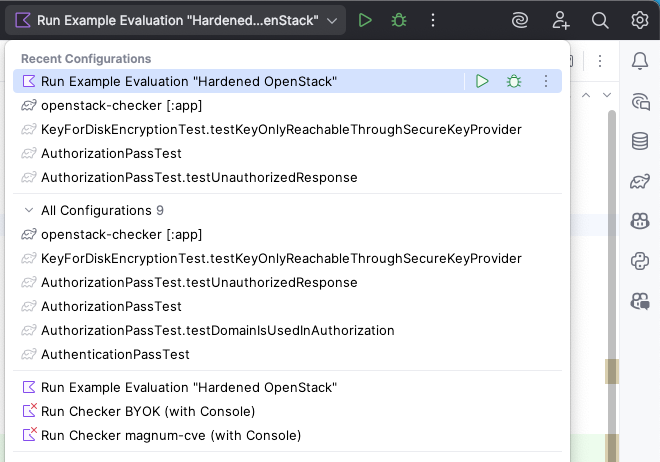

# Hardened OpenStack Example Project

## Usage via Run Configuration in IntelliJ IDEA

We provide a Run Configuration for IntelliJ IDEA which automastically runs the analysis on the `hardened-openstack` project.

You can select this on the top right of the IDE (left of the green play button) and choose `Hardened OpenStack Analysis`.
You can then run the analysis by clicking the green play button.
The menu will look similar to this:



## Expected outcome

The result of the analysis are several tables summarizing the requirements and their status.
Each table corresponds to a specific category of requirements, detailing whether each requirement is fulfilled, along with the confidence level of that assessment.

We expect to see the following tables:

```markdown
# Analysis Results

## Category DEFAULT: Default Requirements Category

| Requirement ID | Requirement Name                                  | Fu... | Confidence      |
| -------------- | ------------------------------------------------- | ----- | --------------- |
| RQ-DEFAULT-001 | Check Security Target Description for Consistency | false | UndecidedResult |

## Category General: General Security Requirements

| Requirement ID | Requirement Name                   | Fu... | Confidence      |
| -------------- | ---------------------------------- | ----- | --------------- |
| RQ-General-001 | Apply Restrictive File Permissions | true  | AcceptedResult  |
| RQ-General-002 | Delete Temporary Files After Use   | true  | AcceptedResult  |
| RQ-General-003 | Delete Secrets after Usage         | false | UndecidedResult |
| RQ-General-004 | Secrets Must not be Logged         | true  | AcceptedResult  |

## Category BYOK: Bring Your Own Key (BYOK)

| Requirement ID | Requirement Name                           | Fu... | Confidence      |
| -------------- | ------------------------------------------ | ----- | --------------- |
| RQ-BYOK-001    | State-of-the-Art Disk Encryption Algorithm | false | UndecidedResult |
| RQ-BYOK-002    | Key for Disk Encryption is Kept Secure     | false | AcceptedResult  |
| RQ-BYOK-003    | Transport Encryption of Key                | true  | AcceptedResult  |
| RQ-BYOK-004    | Key Accessible Only By Valid User          | true  | AcceptedResult  |

## Category Multi-Tenancy: Multi-Tenancy

| Requirement ID       | Requirement Name                                   | Fu... | Confidence      |
| -------------------- | -------------------------------------------------- | ----- | --------------- |
| RQ-Multi-Tenancy-001 | Use Keystone for Authentication                    | true  | AcceptedResult  |
| RQ-Multi-Tenancy-002 | All Endpoints Must Have Authentication Enabled     | true  | AcceptedResult  |
| RQ-Multi-Tenancy-003 | Token-based Authentication                         | false | UndecidedResult |
| RQ-Multi-Tenancy-004 | Domain/Project used in Authorization Checks        | false | UndecidedResult |
| RQ-Multi-Tenancy-005 | No Data Flows to Globals in User-Scoped Requests   | true  | AcceptedResult  |
| RQ-Multi-Tenancy-006 | Respond with Unauthorized Access for Other Domains | false | AcceptedResult  |

## Category Ecosystem: Ecosystem

| Requirement ID   | Requirement Name               | Fu... | Confidence     |
| ---------------- | ------------------------------ | ----- | -------------- |
| RQ-Ecosystem-001 | No Known Vulnerabilities       | true  | AcceptedResult |
| RQ-Ecosystem-002 | Continuous Maintenance         | true  | AcceptedResult |
| RQ-Ecosystem-003 | CI/CD Best Practices           | false | AcceptedResult |
| RQ-Ecosystem-004 | Continuous Testing             | false | AcceptedResult |
| RQ-Ecosystem-005 | CI/CD Security                 | false | AcceptedResult |
| RQ-Ecosystem-006 | Code Contributions and Reviews | false | AcceptedResult |
| RQ-Ecosystem-007 | Build Risks                    | false | AcceptedResult |
```